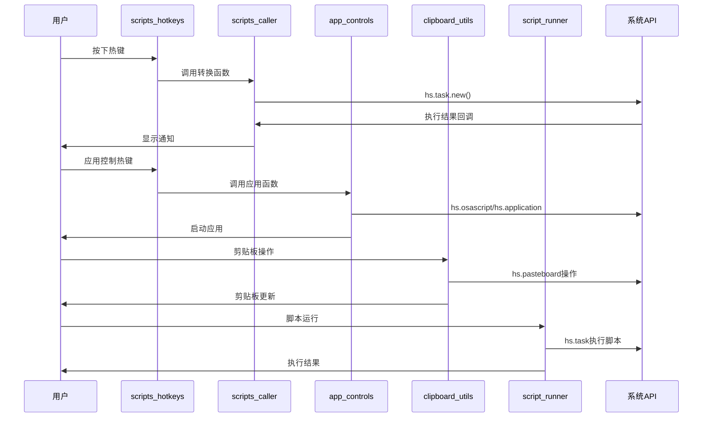

# Hammerspoon Lua 模块技术架构文档

## 🏗️ 整体架构概述

本文档详细说明 Hammerspoon lua1 目录下各个模块的技术实现、API调用关系和代码架构。

### 模块分层架构

```
┌─────────────────────────────────────────────────────────────┐
│                    用户交互层 (UI Layer)                      │
├─────────────────────────────────────────────────────────────┤
│  scripts_hotkeys.lua (主热键配置) | clipboard_hotkeys.lua   │
├─────────────────────────────────────────────────────────────┤
│                    业务逻辑层 (Business Logic)                │
├─────────────────────────────────────────────────────────────┤
│  scripts_caller.lua | app_controls.lua | clipboard_utils.lua │
│  script_runner.lua                                          │
├─────────────────────────────────────────────────────────────┤
│                    系统调用层 (System Layer)                  │
├─────────────────────────────────────────────────────────────┤
│  hs.task | hs.application | hs.osascript | hs.pasteboard   │
├─────────────────────────────────────────────────────────────┤
│                    外部资源层 (External Layer)                │
├─────────────────────────────────────────────────────────────┤
│  scripts_ray/* | 系统应用 | 文件系统 | 剪贴板              │
└─────────────────────────────────────────────────────────────┘
```

## 📱 模块详细技术分析

### 1. scripts_caller.lua - 脚本调用封装模块

#### 核心配置结构
```lua
local config = {
    python_path = "/Users/tianli/miniforge3/bin/python3",
    bash_path = "/bin/bash",
    scripts_dir = hs.configdir .. "/scripts_ray",
    
    scripts = {
        -- 脚本映射表 (25个脚本)
        convert_csv_to_txt = "convert_csv_to_txt.py",
        -- ... 其他脚本映射
    }
}
```

#### 核心函数实现

**execute_script() - 通用脚本执行器**
```lua
-- 功能：异步执行外部脚本，支持回调
-- 参数：script_name, args, callback
-- 调用：hs.task.new() + task:setWorkingDirectory() + task:start()
-- 特点：自动识别脚本类型(.py/.sh)，设置工作目录，异步执行
```

**get_selected_files() - Finder文件获取**
```lua
-- 功能：获取Finder中选中的文件列表
-- 实现：hs.osascript.applescript() + AppleScript
-- 返回：文件路径数组
-- 容错：失败时返回空数组
```

#### API模块划分

1. **convert 模块** - 文件转换
   - csv_to_txt/xlsx, txt_to_csv/xlsx, xlsx_to_csv/txt
   - docx_to_md, pptx_to_md, office_batch

2. **extract 模块** - 内容提取  
   - images, tables, text_tokens

3. **file 模块** - 文件管理
   - move_up_level

4. **merge 模块** - 文件合并
   - csv_files, markdown_files

5. **manage 模块** - 系统管理
   - launch_apps, pip_packages

### 2. app_controls.lua - 应用控制模块

#### 核心函数架构

**get_finder_current_dir() - 目录获取**
```lua
-- 实现：AppleScript + hs.osascript.applescript()
-- 逻辑：检查selection -> folder/file container -> insertion location
-- 容错：fallback to HOME directory
```

**run_in_ghostty/terminal() - 终端命令执行**
```lua
-- 流程：检查应用状态 -> 激活/启动应用 -> 创建新标签 -> 执行命令
-- 技术：hs.application API + hs.eventtap.keyStroke() + 剪贴板操作
-- 时序：使用hs.timer.doAfter()进行时序控制
```

#### 应用启动策略

1. **Ghostty/Terminal**: 原生应用控制
   - hs.application.find() -> activate() -> keyStroke()

2. **VS Code/Cursor**: 命令行启动
   - hs.task.new() + 多路径尝试 (/usr/local/bin, /opt/homebrew/bin)

3. **Nvim**: 组合启动
   - Ghostty启动 + cd命令 + nvim命令组合

#### 导出的工具函数
```lua
app_controls.utils = {
    get_finder_current_dir,    -- 目录获取
    get_selected_single_file,  -- 单文件获取  
    run_in_ghostty,           -- Ghostty执行
    run_in_terminal           -- Terminal执行
}
```

### 3. clipboard_utils.lua - 剪贴板工具模块

#### 核心数据流

**文件选择 -> 内容处理 -> 剪贴板操作**

#### 关键函数实现

**get_selected_multiple_files() - 多文件获取**
```lua
-- AppleScript实现：selection as list -> repeat loop -> POSIX path
-- 数据处理：逗号分割 + trim处理
-- 返回：文件路径数组
```

**copy_filenames() - 文件名复制**
```lua
-- 流程：获取选中文件 -> 提取displayName -> 换行符连接 -> 剪贴板
-- API：hs.fs.displayName() + hs.pasteboard.setContents()
```

**copy_names_and_content() - 文件内容复制**
```lua
-- 流程：文件验证 -> 内容读取 -> 格式化 -> 剪贴板
-- 技术：hs.fs.attributes() + io.open() + 文本处理
-- 格式：文件名 + 内容 + 分隔符
```

**paste_to_finder() - 文件粘贴**
```lua
-- 检测：detect_clipboard_type() -> contentTypes()分析
-- 执行：paste_with_applescript() -> Finder激活 + keystroke
-- 支持：仅文件类型粘贴，自动类型检测
```

#### 剪贴板类型检测机制
```lua
function detect_clipboard_type()
    -- 检查contentTypes中的文件相关类型
    -- "public.file-url", "public.url", "CorePasteboardFlavorType 0x6675726C"
    -- 返回："files", "text", "empty"
end
```

### 4. script_runner.lua - 脚本运行器模块

#### 配置与路径管理
```lua
local config = {
    python_path = "/Users/tianli/miniforge3/bin/python3",
    miniforge_bin = "/Users/tianli/miniforge3/bin", 
    temp_dir = os.getenv("HOME") .. "/.hammerspoon_temp"
}
```

#### 核心执行机制

**run_single() - 单脚本执行**
```lua
-- 验证：is_executable_script() 检查文件扩展名
-- 权限：make_executable() 设置shell脚本执行权限  
-- 执行：hs.task.new() + 异步回调
-- 监控：exit_code处理 + stdout/stderr输出
```

**run_parallel() - 并行执行**
```lua
-- 筛选：过滤可执行脚本
-- 计数：completed_count/success_count统计
-- 回调：on_script_complete()统一处理结果
-- 输出：详细的执行报告和汇总
```

**run_python_here() - 即时Python执行**
```lua
-- 交互：hs.dialog.textPrompt()获取代码
-- 临时：创建temp_script.py文件
-- 执行：在当前Finder目录执行
-- 清理：自动删除临时文件
```

#### 脚本识别与执行策略
```lua
-- .py文件：python_path + script_path
-- .sh文件：/bin/bash + script_path + chmod +x
-- 工作目录：脚本所在目录或Finder当前目录
```

### 5. clipboard_hotkeys.lua - 剪贴板热键配置

#### 简单的热键绑定层
```lua
-- 设计：薄封装层，直接调用clipboard_utils函数
-- 热键：3个核心快捷键绑定
-- 模式：hs.hotkey.bind() + 函数回调
```

#### 热键映射表
```lua
{ "cmd", "ctrl", "shift" }, "n" -> clipboard_utils.copy_filenames()
{ "cmd", "ctrl", "shift" }, "c" -> clipboard_utils.copy_names_and_content()  
{ "ctrl", "alt" }, "v" -> clipboard_utils.paste_to_finder()
```

### 6. scripts_hotkeys.lua - 主热键配置中心

#### 模块依赖管理
```lua
local scripts = require("lua1.scripts_caller")
local apps = require("lua1.app_controls")  
local runner = require("lua1.script_runner")
```

#### 热键组织架构

**热键分组设计**
```lua
convert_hotkeys = {}     -- 文件转换 (⌘⌥⇧ + 键)
extract_hotkeys = {}     -- 内容提取 (⌘⌃⇧ + 键)  
file_hotkeys = {}        -- 文件管理 (⌘⌃⌥ + 键)
app_hotkeys = {}         -- 应用控制 (⌘⌃⇧ + 键)
script_hotkeys = {}      -- 脚本运行 (⌘⌃⇧ + 键)
```

**智能上下文菜单实现**
```lua
function show_context_menu()
    -- 1. 获取选中文件：scripts.utils.get_selected_files()
    -- 2. 分析文件类型：文件扩展名提取
    -- 3. 构建菜单项：根据类型添加相应选项
    -- 4. 显示菜单：hs.menubar + popupMenu()
end
```

#### 应用自动化机制
```lua
function setup_app_automation()
    -- hs.application.watcher监控应用切换
    -- Finder激活时预加载文件信息
    -- 可扩展为更多应用状态感知
end
```

## 🔗 模块间调用关系图

### 数据流向分析



### API依赖矩阵

| 模块 | hs.task | hs.application | hs.osascript | hs.pasteboard | hs.hotkey |
|------|---------|----------------|--------------|---------------|-----------|
| scripts_caller | ✅ | ❌ | ✅ | ❌ | ❌ |
| app_controls | ✅ | ✅ | ✅ | ✅ | ❌ |
| clipboard_utils | ❌ | ❌ | ✅ | ✅ | ❌ |
| script_runner | ✅ | ❌ | ✅ | ❌ | ❌ |
| scripts_hotkeys | ❌ | ✅ | ❌ | ❌ | ✅ |
| clipboard_hotkeys | ❌ | ❌ | ❌ | ❌ | ✅ |

## 🔧 技术实现细节

### 异步执行模式

所有耗时操作都采用异步模式：
```lua
-- hs.task.new(command, callback, arguments)
-- 避免阻塞主线程
-- 支持进度回调和错误处理
```

### 错误处理策略

1. **路径容错**：多路径尝试 + fallback机制
2. **文件验证**：hs.fs.attributes()检查文件存在性
3. **类型检查**：扩展名和MIME类型双重验证
4. **用户反馈**：hs.alert + hs.notify双重通知

### 性能优化措施

1. **延迟加载**：require()按需加载模块
2. **缓存机制**：避免重复的AppleScript调用
3. **批量处理**：并行执行减少总时间
4. **资源清理**：临时文件自动清理

### 扩展接口设计

每个模块都暴露工具函数供其他模块调用：
```lua
module.utils = {
    -- 通用函数导出
    -- 便于模块间协作和功能复用
}
```

## 🚀 部署与配置

### 环境依赖

1. **Hammerspoon**: macOS自动化框架
2. **Python环境**: miniforge3 + 必要包
3. **scripts_ray**: 外部脚本集合
4. **系统应用**: Ghostty, Cursor, VS Code等

### 配置检查清单

- [ ] Python路径正确 (`/Users/tianli/miniforge3/bin/python3`)
- [ ] scripts_ray目录存在 (`hs.configdir .. "/scripts_ray"`)
- [ ] 临时目录权限 (`~/.hammerspoon_temp`)
- [ ] 目标应用已安装 (Ghostty, Cursor等)
- [ ] Hammerspoon辅助功能权限已授予

### 模块加载顺序

```lua
1. clipboard_utils.lua      -- 基础工具
2. clipboard_hotkeys.lua    -- 剪贴板热键
3. app_controls.lua         -- 应用控制
4. script_runner.lua        -- 脚本运行器
5. scripts_caller.lua       -- 脚本调用
6. scripts_hotkeys.lua      -- 主配置(最后加载)
```

## 📊 性能指标

### 响应时间目标

- 热键触发响应: < 50ms
- 文件转换启动: < 200ms  
- 应用启动响应: < 500ms
- 剪贴板操作: < 100ms

### 资源消耗

- 内存占用: ~10MB (所有模块加载后)
- CPU使用: 平时 ~0%, 执行时根据任务而定
- 磁盘空间: 临时文件 < 100MB

## 🔍 故障诊断

### 常见问题解决

1. **模块加载失败**
   ```lua
   -- 检查require路径
   -- 确认文件存在性
   -- 查看Hammerspoon控制台错误
   ```

2. **脚本执行失败**
   ```lua
   -- 验证Python路径
   -- 检查scripts_ray目录
   -- 确认脚本执行权限
   ```

3. **应用控制无效**
   ```lua
   -- 检查应用是否安装
   -- 验证命令行工具路径
   -- 确认辅助功能权限
   ```

### 调试技巧

1. **启用详细日志**：在各模块添加print()语句
2. **控制台监控**：实时查看Hammerspoon控制台
3. **分步测试**：逐个模块测试功能
4. **路径验证**：手动验证所有配置路径

这个技术架构为Hammerspoon自动化提供了可靠、可扩展的基础！🚀 