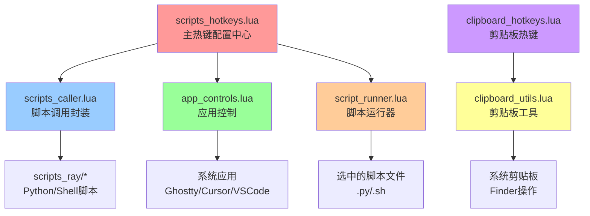

# Hammerspoon + Scripts_ray 集成使用说明

## 🎯 项目概述

这个集成将强大的 **scripts_ray 工具集** 与 **Hammerspoon** 结合，通过Lua脚本调用各种文件转换、内容提取、文件管理功能，提供比Raycast更深度的系统集成和自动化能力。

## 🏗️ 架构设计

```
Hammerspoon 入口
       ↓
  scripts_hotkeys.lua (热键配置中心)
       ↓
  ┌─────────────────────────────────────────┐
  │  scripts_caller.lua (脚本调用封装)        │
  │  app_controls.lua (应用控制)             │
  │  clipboard_utils.lua (剪贴板工具)        │
  │  script_runner.lua (脚本运行器)          │
  └─────────────────────────────────────────┘
       ↓
  hs.task / hs.application / hs.osascript
       ↓
  scripts_ray/* (实际功能脚本) / 系统应用
```

### 核心文件结构

```
hammerspoon/lua1/
├── scripts_caller.lua           # 🔧 scripts_ray脚本调用封装
├── app_controls.lua            # 📱 应用控制和启动管理
├── clipboard_utils.lua         # 📋 剪贴板工具函数
├── clipboard_hotkeys.lua       # ⌨️ 剪贴板热键配置
├── script_runner.lua          # 🏃 脚本运行器（单个/并行）
├── scripts_hotkeys.lua        # 🔥 主热键配置中心
└── README_scripts_integration.md  # 📖 本说明文档
```

## 📱 核心模块详解

### 1. scripts_caller.lua - 脚本调用封装模块

**主要功能：**
- 封装对 scripts_ray 目录下 Python/Shell 脚本的调用
- 提供统一的脚本执行接口
- 支持异步执行和回调处理

**调用的外部脚本：**
```lua
-- 文件转换类
convert_csv_to_txt.py        # CSV转TXT
convert_csv_to_xlsx.py       # CSV转Excel
convert_txt_to_csv.py        # TXT转CSV
convert_xlsx_to_csv.py       # Excel转CSV
convert_docx_to_md.sh        # Word转Markdown
convert_pptx_to_md.py        # PowerPoint转Markdown

-- 内容提取类
extract_images_office.py     # 提取Office文档图片
extract_tables_office.py     # 提取Office文档表格
extract_text_tokens.py       # 计算文本Token数

-- 文件管理类
file_move_up_level.sh        # 文件上移一级
merge_csv_files.sh           # 合并CSV文件
merge_markdown_files.sh      # 合并Markdown文件

-- 系统管理类
manage_app_launcher.sh       # 应用启动管理
manage_pip_packages.sh       # Python包管理
```

### 2. app_controls.lua - 应用控制模块

**主要功能：**
- 在指定应用中打开当前Finder目录
- 智能应用启动和文件操作
- 提供通用的目录和文件获取函数

**调用的系统功能：**
```lua
-- AppleScript调用
hs.osascript.applescript()   # 获取Finder状态和文件信息

-- 应用启动和控制
hs.application.find()        # 查找应用
hs.application.open()        # 启动应用
hs.eventtap.keyStroke()      # 模拟键盘输入

-- 系统命令调用
hs.task.new()               # 执行外部命令（code, cursor等）
```

**支持的应用：**
- Ghostty (终端应用)
- Terminal (系统终端) 
- VS Code (代码编辑器)
- Cursor (AI代码编辑器)
- Nvim (通过Ghostty启动)

### 3. clipboard_utils.lua - 剪贴板工具模块

**主要功能：**
- 复制选中文件的文件名到剪贴板
- 复制文件名和内容到剪贴板  
- 从剪贴板粘贴文件到Finder当前目录

**调用的系统API：**
```lua
-- 剪贴板操作
hs.pasteboard.getContents()     # 获取剪贴板内容
hs.pasteboard.setContents()     # 设置剪贴板内容
hs.pasteboard.contentTypes()    # 获取内容类型

-- 文件系统操作
hs.fs.attributes()              # 获取文件属性
hs.fs.displayName()             # 获取文件显示名
io.open() / file:read()         # 文件读取操作

-- AppleScript文件操作
hs.osascript.applescript()      # Finder选择和粘贴操作
```

### 4. script_runner.lua - 脚本运行器模块

**主要功能：**
- 运行选中的单个脚本文件
- 并行运行多个脚本文件
- 快速执行Python代码片段

**支持的脚本类型：**
- Python脚本 (.py)
- Shell脚本 (.sh)
- 临时Python代码执行

**调用的系统功能：**
```lua
-- 任务执行
hs.task.new()                   # 创建异步任务
task:setWorkingDirectory()      # 设置工作目录
task:start()                   # 启动任务

-- 文件系统
hs.fs.mkdir()                  # 创建临时目录
os.remove()                    # 清理临时文件

-- 用户交互
hs.dialog.textPrompt()         # Python代码输入对话框
```

### 5. clipboard_hotkeys.lua - 剪贴板热键配置

**功能：**
- 配置剪贴板相关的3个热键
- 作为clipboard_utils模块的热键绑定层

**热键配置：**
```lua
⌘⌃⇧ + N : 复制文件名
⌘⌃⇧ + C : 复制文件名和内容  
⌃⌥ + V  : 粘贴到Finder
```

### 6. scripts_hotkeys.lua - 主热键配置中心

**主要功能：**
- 整合所有模块的热键配置
- 提供智能上下文菜单
- 设置应用自动化规则

**调用的模块：**
```lua
local scripts = require("lua1.scripts_caller")    # 脚本调用
local apps = require("lua1.app_controls")        # 应用控制
local runner = require("lua1.script_runner")     # 脚本运行器
```

## ⚡ 快速开始

### 1. 配置路径

在各模块中确认路径正确：

**scripts_caller.lua:**
```lua
local config = {
    python_path = "/Users/tianli/miniforge3/bin/python3",
    scripts_dir = hs.configdir .. "/scripts_ray",
}
```

**script_runner.lua:**
```lua
local config = {
    python_path = "/Users/tianli/miniforge3/bin/python3",
    temp_dir = os.getenv("HOME") .. "/.hammerspoon_temp"
}
```

### 2. 重载Hammerspoon配置

```bash
# 重启Hammerspoon或按 ⌘⌃⇧R 重载配置
```

### 3. 测试功能

1. 在Finder中选择一个CSV文件
2. 按 `⌘⌥⇧ + 2` 转换为Excel格式
3. 查看通知确认转换结果

## 🔥 热键功能清单

### 📄 文件转换 (`⌘⌥⇧` + 键)

| 热键 | 功能 | 调用模块 | 说明 |
|------|------|----------|------|
| `⌘⌥⇧ + 1` | CSV→TXT | scripts_caller | 将CSV转换为制表符分隔的TXT |
| `⌘⌥⇧ + 2` | CSV→XLSX | scripts_caller | 将CSV转换为Excel格式 |
| `⌘⌥⇧ + 3` | TXT→CSV | scripts_caller | 将文本转换为CSV格式 |
| `⌘⌥⇧ + 4` | XLSX→CSV | scripts_caller | 将Excel转换为CSV格式 |
| `⌘⌥⇧ + D` | DOCX→MD | scripts_caller | 将Word文档转换为Markdown |
| `⌘⌥⇧ + P` | PPTX→MD | scripts_caller | 将PowerPoint转换为Markdown |
| `⌘⌥⇧ + A` | 批量转换 | scripts_caller | 递归转换当前目录所有支持文件 |

### 🎯 内容提取 (`⌘⌃⇧` + 键)

| 热键 | 功能 | 调用模块 | 说明 |
|------|------|----------|------|
| `⌘⌃⇧ + I` | 提取图片 | scripts_caller | 从Office文档提取所有图片 |
| `⌘⌃⇧ + T` | 提取表格 | scripts_caller | 从Office文档提取表格为CSV |
| `⌘⌃⇧ + K` | 计算Tokens | scripts_caller | 计算文本文件的Token数量 |

### 📁 文件管理 (`⌘⌃⌥` + 键)

| 热键 | 功能 | 调用模块 | 说明 |
|------|------|----------|------|
| `⌘⌃⌥ + U` | 文件上移 | scripts_caller | 将文件夹内容移到上级目录 |
| `⌘⌃⌥ + C` | 合并CSV | scripts_caller | 合并当前目录所有CSV文件 |
| `⌘⌃⌥ + M` | 合并Markdown | scripts_caller | 合并当前目录所有MD文件 |

### 📱 应用控制 (`⌘⌃⇧` + 键)

| 热键 | 功能 | 调用模块 | 说明 |
|------|------|----------|------|
| `⌘⌃⇧ + T` | Ghostty在此处打开 | app_controls | 在当前Finder目录打开Ghostty |
| `⌘⌃⇧ + W` | Cursor在此处打开 | app_controls | 在当前Finder目录打开Cursor |
| `⌘⌃⇧ + V` | Nvim在Ghostty中打开文件 | app_controls | 用Nvim打开选中文件 |
| `⌘⇧ + N` | 创建新文件夹 | app_controls | 在当前位置创建文件夹 |

### 📋 剪贴板操作

| 热键 | 功能 | 调用模块 | 说明 |
|------|------|----------|------|
| `⌘⌃⇧ + N` | 复制文件名 | clipboard_utils | 复制选中文件名到剪贴板 |
| `⌘⌃⇧ + C` | 复制文件名和内容 | clipboard_utils | 复制文件名和内容到剪贴板 |
| `⌃⌥ + V` | 粘贴到Finder | clipboard_utils | 将剪贴板文件粘贴到当前目录 |

### 🏃 脚本运行 (`⌘⌃⇧` + 键)

| 热键 | 功能 | 调用模块 | 说明 |
|------|------|----------|------|
| `⌘⌃⇧ + S` | 运行选中脚本 | script_runner | 运行选中的单个脚本文件 |
| `⌘⌃⇧ + R` | 并行运行脚本 | script_runner | 并行运行多个脚本文件 |

### ⚙️ 系统管理

| 热键 | 功能 | 调用模块 | 说明 |
|------|------|----------|------|
| `⌘⌃⌥⇧ + L` | 启动应用 | scripts_caller | 启动预定义的应用程序组合 |
| `⌘⌃⇧ + P` | Python包管理 | scripts_caller | 更新Python包 |

### 🎛️ 智能功能

| 热键 | 功能 | 调用模块 | 说明 |
|------|------|----------|------|
| `⌘⌃⌥ + Space` | 智能转换菜单 | scripts_hotkeys | 根据选中文件类型显示可用操作 |

## 🎨 智能上下文菜单

### 使用方法

1. 在Finder中选择文件
2. 按 `⌘⌃⌥ + Space`
3. 系统会根据文件类型智能显示可用的转换选项

### 支持的文件类型

- **CSV文件**: 显示转换为TXT、XLSX的选项
- **TXT文件**: 显示转换为CSV、XLSX的选项  
- **Excel文件**: 显示转换为CSV、TXT的选项
- **Word文档**: 显示转换为Markdown的选项
- **PowerPoint**: 显示转换为Markdown的选项
- **Office文档**: 额外显示内容提取选项（图片、表格）

## 🛠️ 模块依赖关系



## 🔧 高级功能

### 1. 自定义回调处理

```lua
-- 自定义转换完成后的处理
scripts.convert.csv_to_xlsx(nil, function(exit_code, stdout, stderr)
    if exit_code == 0 then
        hs.alert.show("转换成功！")
        -- 可以添加自定义逻辑，如打开转换后的文件
    else
        hs.alert.show("转换失败: " .. (stderr or "未知错误"))
    end
end)
```

### 2. 批量处理特定目录

```lua
-- 转换指定目录的文件
local files = {"/path/to/file1.csv", "/path/to/file2.csv"}
scripts.convert.csv_to_xlsx(files)
```

### 3. 自动化工作流

```lua
-- 示例：下载文件夹监控自动转换
local function auto_convert_downloads()
    local downloads = os.getenv("HOME") .. "/Downloads"
    local watcher = hs.pathwatcher.new(downloads, function(files)
        for _, file in ipairs(files) do
            if file:match("%.csv$") then
                -- 自动转换新下载的CSV文件
                scripts.convert.csv_to_xlsx({file})
            end
        end
    end)
    watcher:start()
end
```

## 🔧 配置定制

### 修改脚本路径

编辑各模块中的配置：

**scripts_caller.lua:**
```lua
local config = {
    python_path = "/your/python/path",
    scripts_dir = "/your/scripts/directory",
}
```

**script_runner.lua:**
```lua
local config = {
    python_path = "/your/python/path", 
    temp_dir = "/your/temp/directory"
}
```

### 添加新的热键

在 `scripts_hotkeys.lua` 中添加：

```lua
-- 添加到相应的热键组
local new_hotkeys = {
    {{"cmd", "alt", "shift"}, "n", "新功能", function() 
        scripts.your_module.your_function() 
    end},
}
```

### 自定义智能菜单

修改 `show_context_menu()` 函数，添加新的文件类型支持：

```lua
if file_types.your_extension then
    table.insert(menu_items, {
        title = "你的转换选项",
        fn = function() scripts.your_module.your_function(files) end
    })
end
```

## 📊 与Raycast对比

| 功能 | Raycast | Hammerspoon |
|------|---------|-------------|
| **触发方式** | 命令搜索 | 全局热键 |
| **文件选择** | Finder选择 | Finder选择 + 路径指定 |
| **自动化程度** | 手动触发 | 热键 + 自动监控 |
| **上下文感知** | 基础 | 智能菜单 + 文件类型检测 |
| **工作流集成** | 有限 | 深度集成（应用状态、文件监控等） |
| **自定义能力** | 脚本层面 | Lua编程，更灵活 |
| **模块化程度** | 单脚本 | 模块化架构，可复用 |

## 🚀 最佳实践

### 1. 工作流建议

1. **文档处理流程**：
   - 选择文件 → `⌘⌃⌥ + Space` → 选择转换选项
   
2. **批量处理**：
   - 进入目标目录 → `⌘⌥⇧ + A` → 批量转换所有文件

3. **内容提取**：
   - 选择Office文档 → `⌘⌃⇧ + I/T` → 提取图片/表格

4. **应用协作**：
   - `⌘⌃⇧ + T` 打开终端 → `⌘⌃⇧ + W` 打开编辑器 → 无缝工作流

### 2. 性能优化

- 大文件处理建议使用回调函数监控进度
- 批量处理时可以分批执行避免系统负载过高
- 定期清理转换产生的临时文件和script_runner的临时目录

### 3. 故障排除

如果遇到问题：

1. **检查路径配置**：确认Python和scripts_ray路径正确
2. **查看控制台**：Hammerspoon控制台会显示详细错误信息
3. **测试单个脚本**：直接在终端测试scripts_ray脚本是否正常
4. **重载配置**：修改后记得重载Hammerspoon配置
5. **模块依赖**：确保所有require的模块路径正确

## 📈 扩展可能性

这个集成架构为未来扩展提供了无限可能：

- **窗口管理集成**：结合文件转换和窗口操作
- **网络监控**：监控网络下载，自动处理文件
- **应用状态感知**：根据当前应用自动调整功能
- **时间调度**：定时执行批量处理任务
- **团队协作**：集成云盘同步和版本控制
- **更多应用支持**：扩展app_controls支持更多开发工具
- **智能脚本推荐**：根据文件类型和历史操作推荐脚本

这个实现真正将脚本工具集提升到了**智能自动化工作站**的层次！🎉 