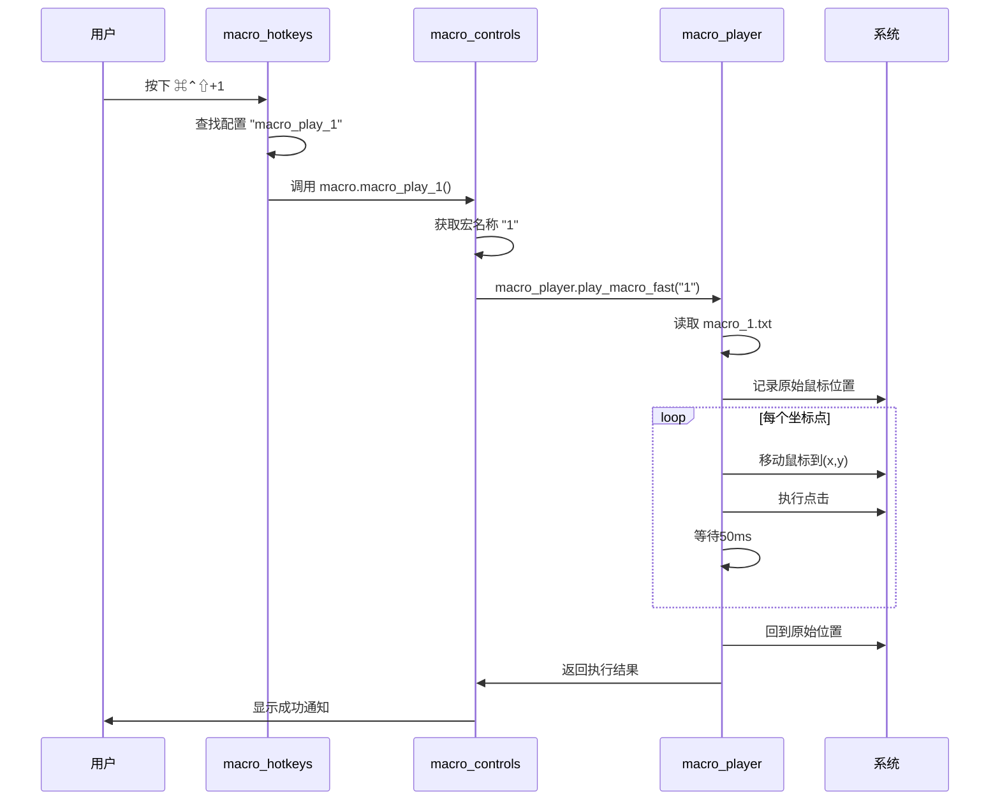

# 宏系统业务逻辑说明

## 系统架构概览

宏系统采用三层架构设计，职责分离，便于维护和扩展：

```
┌─────────────────┐    ┌─────────────────┐    ┌─────────────────┐
│ macro_hotkeys   │───▶│ macro_controls  │───▶│ macro_player    │
│   (快捷键层)     │    │   (控制层)       │    │   (执行层)       │
└─────────────────┘    └─────────────────┘    └─────────────────┘
```

## 模块详细说明

### 1. `macro_player.lua` - 执行层 ⚡

**核心职责**: 高性能宏播放引擎

#### 关键功能

```lua
-- 主要API
macro_player.play_macro_fast(macro_name)      -- 同步快速播放
macro_player.play_macro_async(macro_name, cb) -- 异步播放
macro_player.get_available_macros()           -- 获取可用宏列表
```

#### 业务流程

1. **文件读取**: 
   - 路径: `~/.hammerspoon/macros/macro_[name].txt`
   - 格式: 每行一个坐标 `x,y`
   - 兼容性检查: 支持Hammerspoon和命令行环境

2. **播放执行**:
   - 记录原始鼠标位置
   - 逐个坐标移动并点击
   - 50ms间隔，确保操作流畅
   - 播放完成后回到原始位置

3. **性能优化**:
   - 直接使用 `hs.mouse.absolutePosition()` 和 `hs.eventtap.leftClick()`
   - 避免shell脚本开销
   - 批量文件读取
   - 极小延迟 (50ms vs 500ms)

---

### 2. `macro_controls.lua` - 控制层 🎛️

**核心职责**: 配置驱动的宏播放系统

#### 配置表驱动

```lua
local macro_config = {
    ["1"] = "1",     -- ⌘⌃⇧+1 播放宏1
    ["2"] = "2",     -- ⌘⌃⇧+2 播放宏2  
    ["3"] = "3",     -- ⌘⌃⇧+3 播放宏3
    ["4"] = "4",     -- ⌘⌃⇧+4 播放宏4
}
```

#### 动态函数生成

```lua
-- 工厂函数创建播放器
local function create_macro_player(key_number)
    return function()
        local macro_name = macro_config[tostring(key_number)]
        if macro_name then
            macro_controls.macro_play(macro_name)
        end
    end
end

-- 自动生成 macro_play_1, macro_play_2, macro_play_3, macro_play_4
for key, macro_name in pairs(macro_config) do
    local func_name = "macro_play_" .. key
    macro_controls[func_name] = create_macro_player(key)
end
```

#### 业务流程

1. **配置管理**: 维护快捷键到宏名称的映射
2. **函数生成**: 动态创建播放函数供快捷键调用
3. **播放委托**: 将实际播放任务委托给 `macro_player`
4. **菜单功能**: 提供交互式宏选择菜单

---

### 3. `macro_hotkeys.lua` - 快捷键层 ⌨️

**核心职责**: 独立的快捷键管理

#### 延迟绑定设计

```lua
local macro_hotkey_configs = {
    { { "cmd", "ctrl", "shift" }, "1", "宏播放1", "macro_play_1" },
    { { "cmd", "ctrl", "shift" }, "2", "宏播放2", "macro_play_2" },
    { { "cmd", "ctrl", "shift" }, "3", "宏播放3", "macro_play_3" },
    { { "cmd", "ctrl", "shift" }, "4", "宏播放4", "macro_play_4" },
}
```

#### 动态函数引用

```lua
-- 快捷键触发时动态获取函数
local hotkey = hs.hotkey.bind(modifiers, key, function()
    local callback = macro[func_name]  -- 延迟绑定
    if callback and type(callback) == "function" then
        callback()
    end
end)
```

#### 业务流程

1. **配置存储**: 快捷键配置表存储修饰键、按键、描述、函数名
2. **动态绑定**: 运行时绑定快捷键到系统
3. **函数解析**: 触发时动态获取对应的播放函数
4. **生命周期管理**: 支持绑定/解绑/重新绑定

## 完整业务流程

### 用户按下快捷键 `⌘⌃⇧+1`



## 配置修改流程

### 动态更新宏映射

```lua
-- 1. 更新控制层配置
macro_controls.update_macro_config({
    ["1"] = "login",     -- 将快捷键1改为播放login宏
    ["5"] = "deploy",    -- 添加快捷键5
})

-- 2. 更新快捷键层配置  
macro_hotkeys.update_hotkey_config({
    { { "cmd", "ctrl", "shift" }, "1", "登录宏", "macro_play_1" },
    { { "cmd", "ctrl", "shift" }, "5", "部署宏", "macro_play_5" },
})

-- 3. 重新绑定快捷键
macro_hotkeys.rebind_macro_hotkeys()
```

## 错误处理机制

### 多层错误检查

1. **快捷键层**: 检查函数是否存在
2. **控制层**: 验证宏名称有效性  
3. **执行层**: 检查文件存在性和格式正确性

### 兼容性处理

```lua
-- Hammerspoon环境检查
if hs and hs.mouse and hs.eventtap then
    -- 使用原生API
else
    -- 降级到兼容模式
end
```

## 性能优化要点

### 1. 避免Shell开销
- **旧版**: 通过shell脚本调用 cliclick
- **新版**: 直接使用Lua API

### 2. 减少延迟
- **旧版**: 500ms间隔 + shell启动开销
- **新版**: 50ms间隔，纯内存操作

### 3. 批量操作
- **旧版**: 逐个命令执行
- **新版**: 批量读取，连续执行

## 扩展性设计

### 1. 模块解耦
- 每个模块职责单一，可独立修改
- 接口清晰，便于测试和调试

### 2. 配置驱动
- 通过配置表控制行为
- 无需修改代码即可调整映射

### 3. 插件化
- 可轻松添加新的播放模式
- 支持自定义快捷键组合

## 调试指南

### 1. 独立测试模块
```lua
-- 测试播放器
local player = require("lua1.macro_player")
player.play_macro_fast("test")

-- 测试控制层
local controls = require("lua1.macro_controls")  
controls.macro_play("demo")

-- 测试快捷键
local hotkeys = require("lua1.macro_hotkeys")
hotkeys.show_help()
```

### 2. 日志调试
```lua
-- 开启调试输出
utils.debug_print("模块名", "调试信息")
```

### 3. 性能监控
```lua
-- 测量执行时间
local start_time = os.clock()
-- 执行操作
local elapsed = os.clock() - start_time
```

这种三层架构设计确保了系统的**高性能**、**高可维护性**和**高扩展性**，是一个现代化的宏系统解决方案。 