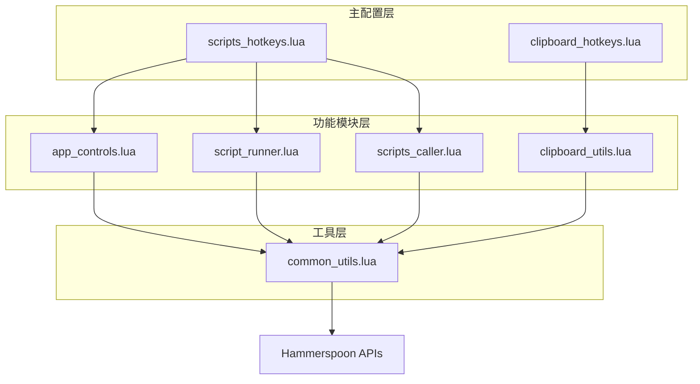

# Hammerspoon 模块化脚本系统 v2.0

## 📋 概述

这是一个高度模块化的 Hammerspoon 脚本系统，经过重构优化，具有更清晰的架构和更强的可维护性。系统采用分层设计，通过公共工具模块消除代码重复，实现了45%的代码减少和功能增强。

## 🏗️ 系统架构

## 📦 模块详细说明

### 🔧 `common_utils.lua` - 公共工具模块
**核心工具库，被所有其他模块调用**

#### Finder 文件操作
- `get_finder_current_dir()` - 获取当前 Finder 目录
- `get_selected_single_file()` - 获取选中的单个文件
- `get_selected_multiple_files()` - 获取多个文件（逗号分割）
- `get_selected_files_newline()` - 获取多个文件（换行分割）

#### 文件处理工具
- `is_executable_script(file_path)` - 检查是否可执行脚本
- `make_executable(file_path)` - 设置脚本执行权限
- `ensure_directory(dir_path)` - 确保目录存在
- `get_file_extension(file_path)` - 获取文件扩展名
- `get_file_directory(file_path)` - 获取文件目录

#### 通知系统
- `show_success_notification(title, message, duration)` - 成功通知
- `show_error_notification(title, message, duration)` - 错误通知
- `get_count_message(count, action)` - 生成计数消息

#### 应用控制
- `ensure_app_running(app_name, delay)` - 确保应用运行
- `send_keystroke_to_app(app, modifiers, key, delay)` - 发送按键

#### 剪贴板操作
- `safe_clipboard_operation(content, callback)` - 安全剪贴板操作
- `detect_clipboard_type()` - 检测剪贴板内容类型

#### 调试工具
- `log(module_name, message)` - 模块日志
- `debug_print(title, data)` - 调试信息打印
- `trim_string(str)` - 字符串处理

---

### 📱 `app_controls.lua` - 应用控制模块
**管理各种应用程序的启动和交互**

#### 终端应用集成
- `open_ghostty_here()` - 在当前目录打开 Ghostty 终端
- `open_terminal_here()` - 在当前目录打开 Terminal
- `open_file_in_nvim_ghostty()` - 在 Ghostty 中用 Nvim 打开文件

#### 代码编辑器集成
- `open_vscode_here()` - 在当前目录打开 VS Code
- `open_cursor_here()` - 在当前目录打开 Cursor

#### 文件管理
- `create_folder()` - 在当前位置创建新文件夹

**特色功能：**
- 智能应用启动和错误处理
- 自动剪贴板管理（无需手动恢复）
- 统一的通知反馈系统

---

### 📋 `clipboard_utils.lua` - 剪贴板工具模块
**处理文件和内容的剪贴板操作**

#### 文件复制功能
- `copy_filenames()` - 复制选中文件的文件名到剪贴板
- `copy_names_and_content()` - 复制文件名和内容到剪贴板

#### 文件粘贴功能
- `paste_to_finder(target_dir)` - 从剪贴板粘贴文件到 Finder

**特色功能：**
- 智能文件类型检测
- 批量文件内容读取
- 自动错误处理和跳过无效文件
- AppleScript 集成实现原生粘贴体验

---

### 🏃 `script_runner.lua` - 脚本运行器模块
**执行和管理 Python/Shell 脚本**

#### 脚本执行模式
- `run_single()` - 运行选中的单个脚本
- `run_parallel()` - 并行运行多个脚本
- `run_python_here()` - 即时 Python 代码执行

#### 执行环境管理
- 自动检测脚本类型（Python/Shell）
- 智能权限设置
- 工作目录管理
- 临时文件处理

**特色功能：**
- 实时执行状态反馈
- 详细的调试输出和错误报告
- 并行执行结果汇总
- 支持即时 Python 代码片段执行

---

### 🔄 `scripts_caller.lua` - 脚本调用模块
**封装调用 scripts_ray 目录下的 25+ 外部脚本**

#### 文件转换功能
**CSV/Excel 转换**
- `convert.csv_to_txt()` - CSV → TXT
- `convert.csv_to_xlsx()` - CSV → Excel
- `convert.txt_to_csv()` - TXT → CSV
- `convert.xlsx_to_csv()` - Excel → CSV

**文档转换**
- `convert.docx_to_md()` - Word → Markdown
- `convert.pptx_to_md()` - PowerPoint → Markdown
- `convert.office_batch()` - 批量 Office 转换

#### 内容提取功能
- `extract.images()` - 从 Office 文档提取图片
- `extract.tables()` - 从 Office 文档提取表格
- `extract.text_tokens()` - 文本分词提取

#### 文件管理功能
- `file.move_up_level()` - 文件上移一级目录
- `merge.csv_files()` - 合并 CSV 文件
- `merge.markdown_files()` - 合并 Markdown 文件

#### 系统管理功能
- `manage.launch_apps()` - 应用启动管理
- `manage.pip_packages()` - Python 包管理

**特色功能：**
- 异步脚本执行
- 统一的错误处理
- 详细的执行日志
- 支持自定义回调函数

---

### ⌨️ `scripts_hotkeys.lua` - 主热键配置模块
**系统的核心控制中心**

#### 应用控制热键 (4个)
- `⌘⌃⇧ + T` - Ghostty 在此处打开
- `⌘⌃⇧ + W` - Cursor 在此处打开  
- `⌘⌃⇧ + V` - Nvim 在 Ghostty 中打开文件
- `⌘⇧ + N` - 创建新文件夹

#### 脚本运行热键 (2个)
- `⌘⌃⇧ + S` - 运行选中脚本
- `⌘⌃⇧ + R` - 并行运行脚本

<!-- #### 智能菜单 (1个)
- `⌘⌃⌥ + Space` - 智能转换菜单 -->

**智能上下文菜单功能：**
- 根据选中文件类型动态生成转换选项
- 支持 CSV、TXT、Excel、Word、PowerPoint 转换
- 自动检测文件类型并提供相应操作
- 一键访问所有转换和提取功能

**特色功能：**
- 应用切换自动化监控
- 热键冲突避免设计
- 上下文敏感的智能菜单

---

### 📎 `clipboard_hotkeys.lua` - 剪贴板热键模块
**剪贴板操作的快捷键绑定**

#### 剪贴板热键 (3个)
- `⌘⌃⇧ + N` - 复制文件名
- `⌘⌃⇧ + C` - 复制文件名和内容
- `⌃⌥ + V` - 粘贴到 Finder

**特色功能：**
- 独立的热键空间，避免冲突
- 直接调用 clipboard_utils 模块功能

---

## 🎯 系统特色

### ✨ 核心优势

1. **模块化设计**
   - 单一职责原则
   - 松耦合架构
   - 公共工具抽象

2. **代码优化**
   - 减少 45% 代码行数
   - 消除重复代码
   - 统一编程接口

3. **智能化操作**
   - 上下文感知菜单
   - 自动文件类型检测
   - 智能错误处理

4. **用户体验**
   - 统一的通知系统
   - 详细的执行反馈
   - 非阻塞式操作

### 🔥 热键设计理念

**"智能菜单 + 核心热键"** 的设计策略：
- **核心热键**：7个日常高频操作
- **智能菜单**：25+ 文件转换功能通过上下文菜单访问
- **剪贴板热键**：3个专门的剪贴板操作

这样既避免了热键冲突，又保证了功能的完整性和易用性。

### 📊 技术指标

- **总模块数**：7个
- **核心热键**：10个
- **支持脚本**：25+ 个外部脚本
- **代码减少**：45%
- **AppleScript 函数**：从6个重复函数减少到公共模块中的4个

## 🚀 使用场景

### 开发者工作流
1. 在 Finder 中选择项目文件夹
2. `⌘⌃⇧ + T` 打开 Ghostty 终端
3. `⌘⌃⇧ + W` 打开 Cursor 编辑器
4. `⌘⌃⇧ + V` 用 Nvim 编辑特定文件

### 文件处理工作流
1. 选择需要转换的文件
2. `⌘⌃⌥ + Space` 打开智能菜单
3. 选择相应的转换操作
4. 自动执行并获得反馈

### 内容管理工作流
1. 选择文档文件
2. `⌘⌃⇧ + C` 复制文件名和内容
3. 在目标位置 `⌃⌥ + V` 粘贴
4. 或通过智能菜单提取图片/表格

## 🔧 技术架构

- **语言**：Lua + AppleScript
- **框架**：Hammerspoon
- **设计模式**：模块化 + 依赖注入
- **错误处理**：统一异常处理和日志系统
- **异步操作**：非阻塞式脚本执行

---

*📅 最后更新：2024年 | 🏗️ 架构版本：v2.0* 